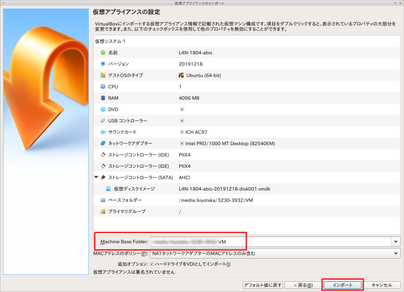
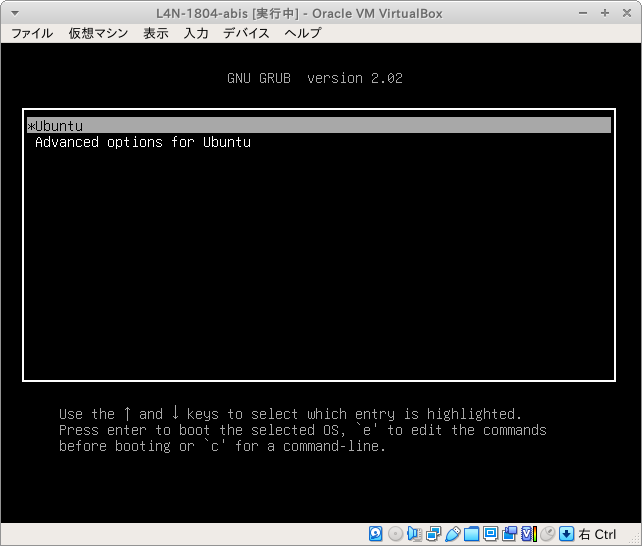
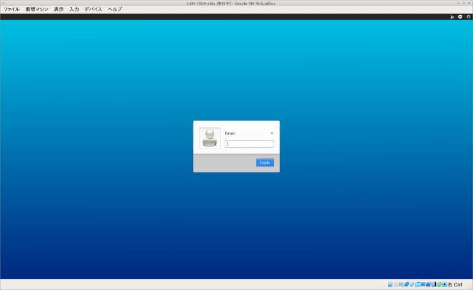

# 第11回ABiS脳画像解析チュートリアル

ここは、2022年01月29-30日に開催予定である **『先端バイオイメージング支援プラットフォーム・ABiSチュートリアル』** の受講者を対象とした情報提供サイトです。新しい情報があれば、随時このサイトへ追加していきますので、定期的にアクセスするようにして下さい

## 新着情報 

- 2021.12.11 チュートリアル用ウェブサイトを立ち上げました

## 会場案内

- 今回はWeb開催となります
- Zoomの開始時間は、**08：30** です

## チュートリアルのスケジュール(予定)

| 日程		| 内容 
| :-- | :-- 
| 01月29日 |  
| 08:30 | Zoomオープン
| 09:00-09:05 | 開会
| 09:05-11:20 | 第1部: 画像解析にまつわる基礎(筑波大学・根本)
| 09:05-10:10 | 第1部(1): DICOM, NIFTIの理解
|             | 脳画像をいじるうえで必要なDICOM形式、NIFTI形式について理解し、<br>画像情報の確認するツールおよび方法を学びます
| 10:20-11:20 | 第1部(2): GLM入門
|             | 脳画像統計解析の基本である一般線形モデルについて学びます
| 11:20-12:30 | -- 昼休み --
| 12:30-14:40 | 第2部: DWI解析の基礎(慶應義塾大学病院・上田)
| 12:30-13:30 | 第2部(1): DWIの前処理
|             | DTIを用いた統計解析であるTract based spatial statistics（TBSS）を<br>行う上で必要な前段の画像処理を実際に体験します
| 13:45-14:45 | 第2部(2): TBSS(Non-FA Analysisも含む)
|             | DTIを用いた統計解析 TBSS を実際に体験します
| 15:00-16:00 | 第2部(3): DWIにおけるGLMの実際 (ケーススタディ)
|             | 群間比較、相関解析、共変数を考慮したTBSS解析のための<br>デザインマトリクスとデザインコントラストの作成を中心に学びます
| 16:15-17:15 | 第2部(4): 拡散テンソルの基礎と3D Slicerを用いたトラクトグラフィーの描出
|             | 拡散テンソルの基礎についての講義と脳画像解析ツールの<br>3D Slicerを用いたトラクトグラフィー作成を実際に体験します
| 17:15-17:30 | 質疑応答(全体)
| 17:30-18:00 | 質疑応答(講師毎)
| 12月19日 | 
| 08:30 | Zoomオープン
| 09:00-14:30 | 第3部: CONNを用いたrs-fMRI解析の基礎 (量子科学技術研究開発機構・八幡)
| 09:00-10:00 | 第3部(1): 導入〜前処理（標準化まで)
|             | 安静時機能的MRI（resting-state fMRI; rsfMRI）やそれに基づいて<br>計測される機能的結合の基本的な概念を押さえた後、<br>rsfMRIデータの標準的な前処理方法について学びます
| 10:10-11:10 | 第3部(2): 機能的結合の導出
|             | rsfMRIデータから機能的結合を求める方法、その過程でアーチファクトを<br>もたらす諸要因やその対処方法などを学びます
| 11:20-12:20 | 第3部(3): 機能的結合に基づく解析（１）領域間結合、グラフ解析など
|             | Voxel-to-voxel, seed-to-seedの機能的結合解析について、<br>個人〜群統計解析の行い方などを学びます
| 12:20-13:20 | -- 昼休み --
| 13:20-14:30 | 第3部(4): 機能的結合に基づく解析（２）独立成分分析など
|             | 独立成分分析（independent component analysis）の基本的概念に<br>触れた上で、rsfMRIデータを用いた個人〜群統計解析の手法を学びます
| 14:40-18:00 | 第4部: SPMを用いたタスクfMRI解析の基礎 (生理学研究所・福永)
| 14:40-15:40 | 第4部(1): 課題提示の作り方
|             | タスク（心理課題）遂行を伴うfMRIデータの実施方法について学びます
| 15:50-16:50 | 第4部(2): First-level
|             | タスク遂行に関連した脳活動の個人レベルにおける評価方法を学びます
| 17:00-18:00 | 第4部(3): Second-level
|             | 個人統計を踏まえた集団解析（群レベルにおける統計解析）の方法論を学びます
| 18:00-18:15 | 質疑応答(全体)
| 18:15-18:30 | 質疑応答(講師毎)


## 予習

- テキストは、画面左上の sf_share アイコンをクリックしていただき、"abis-202201" → "textbook" → "textbook.html" をクリックしていただくと、当日のテキストのリンクが一覧になっています。内容は直前までアップデートされていきますが、事前に目を通していただくと、余裕をもってチュートリアルに参加できると思いますので目を通しておくことをおすすめします。**注意:テキストは2022年1月上旬以降に公開します**


(図ではウィンドウがいくつも立ち上がっていますが説明のためなので実際はファイルマネージャーはいくつも立ち上がりません)

    


----

## パソコンの準備について

- チュートリアルでは、受講者にご自身でPCを準備して頂き、実際に操作しながらコマンドラインについて学んでいきます。PCのスペックについては、以下の **推奨条件** を参考にして下さい

    - OS: Windows10,11 64bit版 または macOS 10.14.6（Mojave）- 12.0.1 (Monterey）
    - CPU: Intel Core i7/i9、Intel Core i5（クロック周波数2.0GHz以上）、または AMD Ryzen 5以上の性能を有するもの **注意: 現在、Apple M1はVirtualBoxで仮想マシンを動作できないため、Lin4Neuroは動作できません**
    - メモリ：8GB以上 (可能ならば16GB以上を推奨します)
    - ハードディスク：100GB以上の空き容量 (外付けハードディスクも可)
    - 2ボタン以上のUSBマウス (必須ではありませんが、持っていると便利です)

- チュートリアルはLin4Neuroでの受講を推奨しますが、macOS native 環境で受講したい方々のために、インストラクションを準備しました。[こちら](macOS_native.md) をご確認ください

- Zoomは画面共有でメモリを相当消費します。そのため、Zoomで受講するための別のPCもしくはタブレットをご準備ください。解析用のPCとZoom用のPCは別々で全く支障ありません

    
## 事前準備

- **チュートリアルの準備には、約8-10時間必要となります。時間に十分に余裕をもって準備をされてください。なお、準備が終わった方にのみ当日のZoomのリンクが送信されますので、必ず準備を行ってください。準備なしの参加はできません**

- チュートリアルに向けて、以下の準備をお願いします

    A. チュートリアル用Lin4Neuro仮想アプライアンスのダウンロード (2-3時間)

    B. VirtualBoxのインストール (10分)

    C. VirtualBoxへのLin4Neuroのインポート (15分)

    D. 仮想マシンの設定 (5分)

    E. Lin4Neuroの起動と設定 (10分)

    F. チュートリアルテキストの入手 (3分)

    G. 受講のためのスクリプト実行 (30分)

    参考. 仮想マシンの削除 (チュートリアル後、不要になった場合)


- 今回は完全オンライン開催ですが、受講者専用サイトに記載されているVirtualBox＋Lin4Neuroの組み合わせで参加することで、過去のチュートリアルと同様にチューターや講師による手厚いサポートが受けることができます。脳画像解析の初心者の方々は受講者専用サイトに記載されている通りに事前準備を行いチュートリアルへ参加することを強く推奨します

- 自分自身で基礎的なトラブルシューティングが行える脳画像解析の経験が豊富な中級者以上の方々は、受講者専用サイトに記載されている以外の解析環境（例えば受講者自身が構築した解析環境など）でもチュートリアルに参加可能ですが、原則としてチューターによるサポートの対象外とさせて頂きますので、ご理解、ご協力の程、よろしくお願いします

- Lin4Neuroは今回のチュートリアルにあわせてアップデートされています。**2021年12月に開催された第10回のものとは、共通ですが、第9回以前のLin4Neuroは使用できませんのでご注意ください**

- ソフトウェアとデータのダウンロードで合計 30GB程度ダウンロードします。Pocket Wi-Fiなどでは確実にパケ死しますので、職場やご自宅のLAN環境から作業してください

- チュートリアルに十分な環境で参加していただくために、受講環境を整えたうえで、スクリプトを実行してその値が正しい場合に限り当日のZoomアドレスをお送りします。従って、11月下旬までに必ず以下の手順を実行してください


### A. チュートリアル用Lin4Neuro仮想アプライアンスのダウンロード (所要時間約1-2時間)

- 分散ダウンロード(推奨): Lin4Neuroは16GBありますので、分散ダウンロードできるプログラムを準備してあります。自身の環境にあわせて以下の対処を行ってください。Lin4Neuroを16のファイルに分割してダウンロードします。ネットワークの環境にもよりますが、1ファイルあたり5-10分程度かかりますので、ダウンロード終了に約1-2時間かかるとお考えください

    - Windows10/11

        - [Windows用ダウンローダー](https://github.com/kytk/abis-web-202201/raw/main/util/l4n_win.zip)をダウンロードします

        - l4n_win.zip を展開します

        - l4n_win フォルダの中にある `get_L4N_win.bat` をダブルクリックします

        - 「WindowsによってPCが保護されました」という画面が出ますので、「詳細情報」をクリックします

        - 右下に「実行」ボタンが出ますので、実行をクリックします

        - コマンドプロンプトの画面が立ち上がり、aria2cというプログラムによるダウンロードが始まります

        - ダウンロードが完了すると、L4N-2004-abis-20211110 フォルダの中に L4N-2004-abis-20211110.ova というファイルが生成されます

        

        

        
 
    - macOS

        - [macOS用ダウンローダー](https://github.com/kytk/abis-web-202201/raw/main/util/l4n_mac.zip)をダウンロードします

        - l4n_mac.zip を展開します

        - l4n_mac フォルダの中にある `get_L4N.command` をダブルクリックします

        - 下図のように「開発元が未確認のため開けません。」と出るので、一度<kbd>OK</kbd>を押して、閉じます

        - 画面左上のAppleメニューから、システム環境設定をクリックし、「セキュリティとプライバシー」をクリックします

        - 「get_L4N.commandは開発元を確認できないため、使用がブロックされました。」の右側にある「このまま開く」をクリックします

        - 「開発元を検証できません。開いてもよろしいですか？」に対して、「開く」を選択します

        - そうすると、ターミナルが起動し、ダウンロードがはじまります

        - ダウンロードが完了すると、ダウンロードフォルダの L4N-2004-abis-20211110 フォルダの中に L4N-2004-abis-20211110.ova というファイルが生成されます

        

        

        

        
 

- 一括ダウンロード: 十分にネットワークが安定している方は、以下からダウンロードしてください。その際、リンクを右クリックして、「名前をつけて保存」から保存してください。16GBありますのでダウンロードには約1時間かかります。ネットワークが細い方は、上の分割ダウンロードを選択してください

    - [L4N-2004-abis-20211110.ovaのダウンロード](http://www.md.tsukuba.ac.jp/clinical-med/psy-neuroimaging/L4N/L4N-2004-abis-20211110.ova){:target="_blank"}

    - L4N-2004-abis-20211110.ovaのmd5値は、`1a43b114f264458230f2265dba11e492` になります。ファイルサイズの検証にお使いください

        - macOSならば、`openssl md5 L4N-2004-abis-20211110.ova` で確認できます
        - Windowsならば、PowerShellから、`Get-FileHash -Algorithm md5 L4N-2004-abis-20211110.ova` で確認できます


### B. VirtualBox 6.1.28以降 のインストール (所要時間約10分)

チュートリアルでは、**<span style="color: red; ">VirtualBox 6.1.28以降</span>**の上で Lin4Neuro を動作させます。最新版の Lin4Neuro は、VirtualBox 6.1.28で最適化されているため、前のバージョンのVirtualBoxを使用の方は**必ず6.1.28以降にアップグレードしてください。**特にmacOSは、以前のバージョンでは仮想マシンが立ち上がらない不具合がありますのでご注意ください。なお、アップグレードする際は、一度、VirtualBoxを終了させないとエラーとなりますのでご注意ください。

- [VirtualBoxのサイト](https://www.virtualbox.org/wiki/Downloads){:target="_blank"} から、ご自身のOSにあったVirtualBoxのインストーラーをダウンロードします

- ダウンロードしたインストーラーを用いてVirtualBox 6.1 をインストールします

- インストール後、VirtualBoxを起動します

    

### C. Lin4Neuro仮想アプライアンスのインポート (所要時間約15分)

- (Windowsで、ディスプレイが推奨サイズ(150%)だと、「次へ」や「インポート」などの画面下部が隠れてしまうことがあります。
その際は、Windowsの設定で推奨サイズを100%にしたり、ファイルを指定した後にEnterを押すなどすれば対応できます)

- ダウンロードした仮想アプライアンス (L4N-2004-abis-20211110.ova) を用いて仮想マシンをインポートします

- VirtualBoxのメニューから **ファイル** → **仮想アプライアンスのインポート** を選択します

    

- ファイルに、ダウンロードした **L4N-2004-abis-20211110.ova** を指定し、 **<kbd>次へ</kbd>** をクリックします

    

- 設定画面が出ます。ひとつだけ気をつけていただきたいのが、 **Machine Base Folder** です。このフォルダの下に仮想マシンがインストールされます。必ず、**<span style="color: red; ">100GB以上あいているところを指定してください</span>**(容量が十分にある場合は、デフォルトのままでかまいません)。外部ハードディスクを指定することもできます。SDカードは、速度が異常に遅く実用性に耐えられませんので、使わないでください

- 設定を確認したうえで、 **インポート** をクリックしてください
- インポートには10−15分程度かかります。辛抱強くお待ちください

    

- インポートが終了すると、VirtualBoxのメイン画面に、 **L4N-2004-abis** が表示されます

    

### D. 仮想マシンの設定 (所要時間約5分)

#### 1. 共有フォルダの設定

- 30GB以上あいているところに、Macの方はFinderから、Windowsの方はエクスプローラーから、 **share** というフォルダを作成します。すべて小文字で作成してください

- あとで確認するため、作成した share フォルダに、何か適当なファイルを入れておいてください

- **Lin4Neuroが起動していない状況で**、VirtualBoxのメイン画面で、L4N-2004-abisをクリックし、選択してから、 **設定** をクリックします

    

- 設定画面の左側のペインで **共有フォルダー** をクリックしたうえで、画面右側の共有フォルダを追加するアイコンをクリックします

    

- **フォルダーのパス** の右側の▼から、**その他...** を選択し、先程作成した **share** フォルダを選択します

- フォルダー名が **share** になっていることを確認します

- **読み込み専用** と **自動マウント** は**チェックが入っていない**ことを確認してください

- このうえで、 **<kbd>OK</kbd>** をクリックします

    


#### 2. ビデオメモリの増加

- 今回配布したLin4Neuroのビデオメモリがデフォルトの33MBになっており、これだと画面を拡大した際にブランクになってしまうことがあります。このため、この設定を変更します

- VirtualBoxのメイン画面で、L4N-2004-abisをクリックし、選択してから、 **設定** をクリックします

    

- 設定画面の左側のペインで **ディスプレイ** をクリックしたうえで、ビデオメモリーをデフォルトの33MBから、最大の 128MB に増やします

- **OK** をクリックして設定画面を閉じます

    

- これで、設定は終了です

### E. Lin4Neuroの起動と設定 (所要時間約10分)

- VirtualBoxのメイン画面から、 **L4N-2004-abis** を選択したうえで、 **起動** をクリックします

    

    - macOSの場合、数のように「"VirtualBox"は、アクセシビリティ機能を使用してこのコンピュータを制御することを求めています。」といった表示が出ることがあります。その場合は、素直にシステム環境設定を開いて、VirtualBoxにアクセスを許可してください。

    

    - macOSの場合、「マイクにアクセスすることを許可します」と出た場合、<kbd>OK</kbd> をクリックして許可してください。そうしないと起動しません

- 下図のような画面になります。Enter/return を押すかそのまま待てば自動で起動します

    

- ログイン画面が立ち上がります。パスワードは **lin4neuro** です。すべて小文字です

    


#### 1. 画面のフォント設定

- VirtualBoxのメニューから "表示" -> "仮想スクリーン" -> "XX%にスケール" を選択してください。適宜見やすい大きさに調整してください

    

#### 2. 共有フォルダの確認

- 画面左上にある **sf_share** は共有フォルダとして設定したものです

- sf_share をダブルクリックし、先程試しに入れたファイルが見えることを確認してください

#### 3. 画像解析ツールの確認

- ログインした後、左下の脳のアイコンをクリックし、 **脳画像解析** をクリックすると、インストールされているソフトウェアを確認できます

    

#### 4. クリップボードの共有設定

- VirtualBoxのメニューから、"デバイス" -> "クリップボードの共有" -> "双方向" を選択します。これによって、ホストマシン(macOS/Windows) でコピーした内容を、仮想マシンの中で貼り付けすることができるようになります。

    

### F. チュートリアルテキストの入手 (所要時間約3分)

- 本チュートリアルで使用するテキストは、GitLabというデータ共有サービスを通して配布します。ここで配布されるものは、チュートリアルの1週間前まで更新される可能性がありますので、こまめに（特に参加直前に）アップデートするようにして下さい

1. 初めてセットアップする時: ターミナル (Lin4Neuro では、左下のスタートアイコンの隣にあるアイコンから起動できます) から以下を実行して下さい

    ```
    cd /media/sf_share
    メールで示されているコマンドをここにタイプします
    (セキュリティの都合でここには記しません)
    ```

2. 更新する時: ターミナルから以下を実行してください

    ```
    cd /media/sf_share/abis-202201
    git pull
    ```

- こうすると、`/media/sf_share/abis-202201` の下に 様々なフォルダが生成されます

<!--
    


- `textbook` の中にテキストへのリンクが掲載されています

- `cheatsheet` には、チュートリアルで皆様にタイプしていただくコマンドがすべて記載されています

- その他のフォルダは講義で使用します

-->

#### プロキシサーバーなどを使っている場合

- PCがプロキシサーバを経由して外部ネットワークに接続されている場合は、先にターミナルから以下のコマンドを入力し、Gitに対するプロキシ設定を行って下さい

    ```
    git config --global http.proxy  http://プロキシ名:ポート番号
    git config --global https.proxy http://プロキシ名:ポート番号
    ```

- プロキシ名やポート番号は、所属機関･部署のネットワーク管理者にお尋ね下さい

- プロキシ設定が不要になった時は、以下のコマンドによって解除できます：

    ```
    git config --global --unset http.proxy
    git config --global --unset https.proxy
    ```

### G. 受講のためのスクリプトを実行 (所要時間約3分)

- 環境がすべて整っているかを確認するために、確認スクリプトを実行していただきます

- ターミナルから以下をタイプしてください

    ```
    cd /media/sf_share/abis-202201
    ./abis_test.sh
    ```

- そうすると以下が表示されます

    ```
    動作確認を行います
    はじめて実行する場合は、3分程度かかります
    最後に出力される数字を報告してください
    はじめてよろしいですか (yes/no)? 
    ```

- `yes` をタイプすると、テストスクリプトが実行されます。

- 最後にターミナルに以下が表示されます。

    ```
    以下の数値を報告してください
    X.XX

    数値報告用のフォームを開いてよろしいですか? 
    yesまたはnoを入力してください

    ```

- `yes` をタイプすると、ブラウザが開きますので、メールアドレス、氏名、ふりがなと数値を入力してください。

- この数字が正しく出力された方は、準備がすべて整ったことになります。メールで、講習会のZoomリンクとSlackのリンクが送付されます
    
- ここまでたどりつけない場合は、事前サポートが必要になります。今回、Zoomのため、チュートリアル当日の個別サポートが提供できませんので、このプロセスは必須とさせていただきます


## Lin4Neuroの終了

- Lin4Neuroを終了するには、左下の脳のアイコンをしたスタートメニューから ログアウト → シャットダウン を選択します

## Zoomの設定

- チュートリアルはZoomにて開催します
- Zoomは2021年11月21日現在、バージョン5.8.4になっています。最新版を入手してください
    - 以下のリンクをクリックすることで、最新版のZoomを入手できます。(すでにインストールされている方でも以下のリンクからインストーラーを入手することでアップデートできます)
    - Windows: [https://zoom.us/client/latest/ZoomInstaller.exe](https://zoom.us/client/latest/ZoomInstaller.exe)
    - macOS: [https://zoom.us/client/latest/Zoom.pkg](https://zoom.us/client/latest/Zoom.pkg)
- 画面の共有の設定だけ変更すると受講しやすくなります
    - Zoomを起動し、サインインをクリックします

    

    - サインインします

    

    - ホーム画面で右上にある歯車アイコンをクリックします

    

    - 左のメニューから「画面の共有」のタブをクリックし、「画面を共有している場合のウィンドウのサイズ」を「現在のサイズを保持する」に変更します。これにより、講師が画面を共有した場合に、Zoomが全画面モードにならずにすみます

    

    - Zoomの設定は以上で終了です

- Zoomはメモリ消費が多いため、可能であれば、Zoomだけタブレットや仮想マシンを動かすPCとは別のPCで利用されることをおすすめします


## 問い合わせ

- 準備がうまくいかない時のために、問い合わせフォームを準備しています。こちらからご質問ください。数日以内に担当者から返信させていただきます

- [問い合わせフォーム](準備中){:target="_blank"} 


## トラブルシューティング

- これまでに問い合わせをいただいた内容とその対策を紹介します

- 【質問】macOSにVirtualBoxをインストールし、Lin4Neuroをインポートし、実行しようとしたところ、以下のエラーメッセージが出て起動しません。

```
The virtual machine 'L4N-2004-abis' has terminated unexpectedly during startup with exit code 1 (0x1).

終了コード : NS_ERROR_FAILURE (0x80004005)
コンポーネント: MachineWrap
インターフェース: IMachine {85632c68-b5bb-4316-a900-5eb28d3413df}

Kernel driver not installed (rc=-1908)

Make sure the kernel module has been loaded successfully.

where: suplibOsInit what: 3 VERR_VM_DRIVER_NOT_INSTALLED (-1908) - The support driver is not installed. On linux, open returned ENOENT. 

```

- 【回答】これは、比較的有名な症状です。rc=-1908 問題と私は勝手に読んでいます。以下を実行してください。https://www.nemotos.net/?p=3707 も参考にしてください。
    - 一度、VirtualBoxをアンインストールしてください。
    - macOSを再起動してください。
    - VirtualBoxをインストールする際に、ダイアログがでる度に、システム環境設定 -> セキュリティを確認してください。
    - "Oracle" のキーワードを見ながら、都度許可を出してください。
    - これでインストールできる可能性が高いです。
    - なお、SIPを無効にする方法は最近はうまくいかないです…


- 【質問】「D. 仮想マシンの設定 (所要時間約5分)」の作業中、VirtualBoxのメイン画面から設定タブを押すと設定画面の下部に「無効な設定が見つかりました。」と表示され、共有フォルダなどの設定が出来ませんでした。設定をしない状態で起動を押しても、「仮想マシン"L4N-2004-abis"のセッションを開けませんでした。」という警告が出てしまいます。

    - 【回答】これは、主にHPのPCで、仮想化が有効にされていないことによります。以下の方法で解決できます

        - 一度インポートしたLin4Neuroの仮想マシンを削除してください。abis-webのページの最後のセクションを参考にしていただけたらと思います。ダウンロードしてできている .ova ファイルはまだ削除しないでください。

        - HPのBIOS設定からVT-xを有効にします。[HPの公式サイト](https://support.hp.com/jp-ja/document/c04773368) に記載がありますので、こちらを参考にしてください。

        - 再起動し、VirtualBoxに再度仮想アプライアンス（L4N-2004-abis-20211110.ova）をインポートします。

- 【質問】「C. Lin4Neuro仮想アプライアンスのインポート」の説明の通りに，ファイル → 仮想アプライアンスのインポート→ ダウンロードした「L4N-2004-abis-20211110.ova 」を指定→Machine Base Folder はデフォルトのまま→インポート，と一連の作業をしてみましたが，「仮想アプライアンスに失敗しました」とエラーが表示されました。ストレージは残り約600GB利用可能です。詳細のボタンをクリックすると「終了コード：NS_ERROR_INVALID_ARG (0x80070057)」と表示されます。

    - 【回答1】これは、Machine Base Folderに同じファイルがなんらかの理由で存在する時に起きる症状です。[こちらのページ](http://www.is.chs.nihon-u.ac.jp/students/file/import_E_INVALIDARG.pdf)に解決法が記載されています

        - 仮想メディアマネージャーを確認し、L4N-2004-abis-xxxx.vdi などがないか確認します。あったら削除してください

        - VirtualBox VMs のフォルダに L4N-2004-abis というフォルダがないかどうかを確認してください。あったらそれを削除してください

        - 再起動したうえで、再度インポートするとインポートできます

    - 【回答2】 もうひとつの可能性は、ダウンロードしたovaファイルが壊れていることによります。再ダウンロードをしていただけたらと思います
    
- 【質問】英語キーボードを使っています。どうすればいいですか。

    - 【回答】配布しているLin4Neuroの仮想マシンは日本語キーボードで設定されています。英語キーボードにするには、以下の作業を行ってください

        - メニューから "設定" -> "Fcitx設定" を選択します

            

        - 画面下の矢印を使って、"キーボード - 英語(US)" が一番来るようにして、ウィンドウを閉じます

            


----

## 参考. 仮想マシンの削除 (チュートリアル後、不要になった場合)

1. 仮想マシンを削除するには、VirtualBoxのメイン画面で、削除したい仮想マシンを選び、右クリックをして、**除去(R)...** を選択します

    

2. 次にあらわれる画面で、**すべてのファイルを削除** を選択します

    


## 参考. Lin4Neuro への Google chrome のインストール (所要時間5分)

- Lin4NeuroにGoogle Chromeをインストールしたい方向けに、説明動画を準備しました。[こちら](https://vimeo.com/487737208){:target="_blank"}からご確認ください


