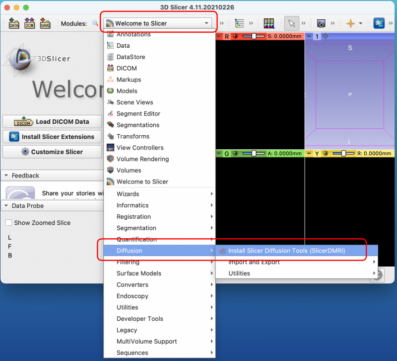
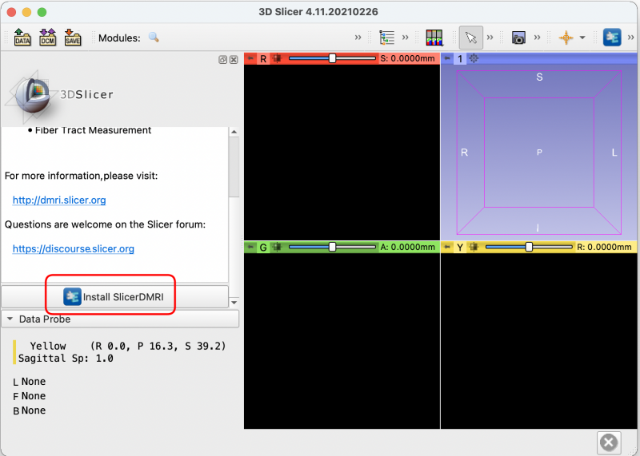
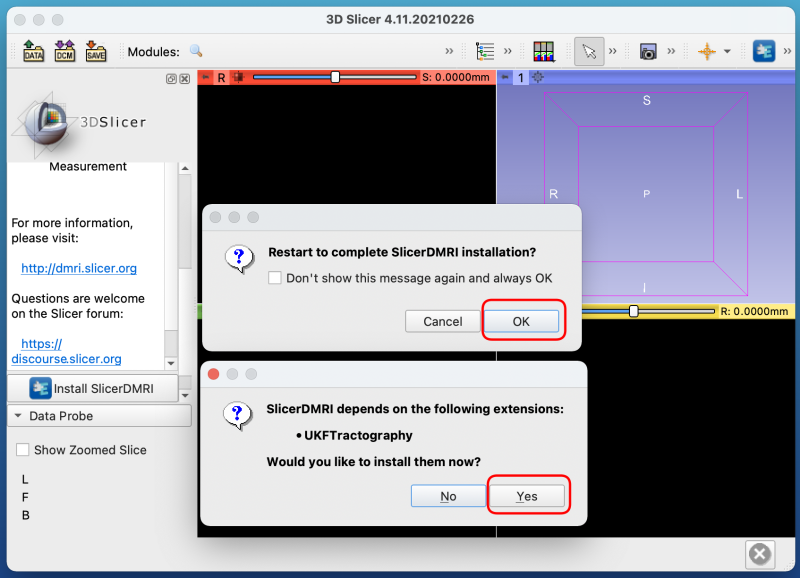

# macOS native 環境での ABiS チュートリアルの準備方法

- 本セクションでは、Lin4Neuro を使わずに、macOS native 環境でのチュートリアルのセットアップ方法を記載します。Apple M1 でも対応可能です。ただし、この方法でのセットアップのサポートは限られることをご了承ください(個人個人で環境がかなり異なるためです)。このインストラクションを読んでわからないことが多い方は、ご自身でのセットアップは難しいとお考えいただき、Lin4Neuroでの受講としてください

## 前提条件

- CPUは Intel でも Apple M1 でも問いません
- ターミナルはデフォルトの zsh を使用することとします

## インストールが必要なソフトウェア
- git
- Octave
- DCMTK
- python3
- Jupyter Notebook (bashとoctaveカーネル含む)
- Mango
- MRIcroGL
- XQuartz
- FSL
- MRtrix3
- ANTs
- 3D Slicer (SlicerDMRI含む)
- Matlab
- SPM
- CONN


### git

#### インストール
- Command line tools for Xcode のインストールにより git を使うことが可能となります

```
xcode-select --install
```

#### 確認
- ターミナルから以下をタイプしていただき、バージョンが出力されれば大丈夫です

```
git --version
```

### Octave

#### インストール
- Homebrew 経由でインストールするのが簡単です。Homebrewのインストールは各自調べてください

```
brew install octave
```

#### 確認
- ターミナルから以下をタイプします

```
octave --version
```

- GNU Octave, version 6.4.0 と表示されればOKです 


### DCMTK

#### インストール
- Octave と同様、Homebrewを使います

```
brew install dcmtk
```

#### 確認
- ターミナルから以下をタイプします

```
dcmdump --version
```

- $dcmtk: dcmdump v3.6.6 2021-01-14 と表示されればOKです


### Python3

#### インストール
- https://www.python.org/ から Python 3.10.1 をダウンロードしてインストールすることにより、Apple M1でも Python が利用可能となります。

- https://www.python.org/ftp/python/3.10.1/python-3.10.1-macos11.pkg

#### 確認
- ターミナルを起動し、以下をタイプしてください。Python 3.10.1 になっていれば大丈夫です

```
python3 --version
```

### Jupyter Notebook および bash と octave のカーネル

#### インストール
- Pythonをインストールした後、以下を実行してください

```
pip3 install jupyter notebook
pip3 install bash_kernel
python3 -m bash_kernel.install
pip3 install octave_kernel
```

#### 確認
- ターミナルから以下をタイプしてください

```
jupyter-notebook
```

- WebブラウザにJupyterという画面が出ればOKです。そのページを消した後、Jupyter Notebookを起動したターミナルで、control + c を押すとJupyter Notebookのサーバーをシャットダウンできますので y を押してシャットダウンしてください

### Mango

#### インストール
- Mango は以下のリンクからインストーラーを入手できます
- http://ric.uthscsa.edu/mango/downloads/mango_mac.zip

#### 確認
- アプリケーションから Mango を起動し、License Agreementが出た後に Mango のメインメニューが出ればOKです

### MRIcroGL

#### インストール
- MRIcroGL は以下のリンクからインストーラーを入手できます
- https://github.com/rordenlab/MRIcroGL/releases/download/v1.2.20211006/MRIcroGL_macOS_which2.dmg
- インストール後、以下のコマンドを実行し、.zprofileに設定を書き込みます。bashの方は.bash_profileに置き換えてください

```
echo '' >> ~/.zprofile
echo '#MRIcroGL' >> ~/.zprofile
echo 'PATH=$PATH:/Applications/MRIcroGL.app/Contents/Resources' >> ~/.zprofile
```

#### 確認
- 一度ターミナルを終了し、ターミナルを再度起動した後に、以下をタイプしてください

```
dcm2niix --version
```

この結果が、v1.0.20211006 と表示されれば大丈夫です

### XQuartz
- XQuartz は FSL の実行のために必要です

#### インストール
- 以下からインストーラーを入手し、実行します
- https://github.com/XQuartz/XQuartz/releases/download/XQuartz-2.8.1/XQuartz-2.8.1.dmg

#### 確認
- FSLが実行されればXQuartzもきちんとインストールされるのでここでは確認しません

### FSL
#### インストール
- 以下をターミナルから実行し、fslinstaller.pyを入手し、実行します

```
cd ~/Downloads
curl -O https://fsl.fmrib.ox.ac.uk/fsldownloads/fslinstaller.py
cd ~/Downloads
python2 ./fslinstaller.py 
```

- インストール完了後、FSLの設定は .profile に記載されるのですが、zshではうまく読み込まれないことがあるので、.zprofileにも記載します

- ターミナルから以下を実行します

```
echo '' >> ~/.zprofile
echo '# FSL Setup' >> ~/.zprofile
echo 'FSLDIR=/usr/local/fsl' >> ~/.zprofile
echo 'PATH=${FSLDIR}/bin:${PATH}' >> ~/.zprofile
echo 'export FSLDIR PATH' >> ~/.zprofile
echo '. ${FSLDIR}/etc/fslconf/fsl.sh' >> ~/.zprofile
```

- これが終わったら一度ターミナルを終了し、再びターミナルを起動します

#### 確認
- ターミナルから以下をタイプします
```
fsl
```

これでFSLが立ち上がればOKです

### MRtrix3
#### インストール
- ターミナルから以下を実行します

```
sudo bash -c "$(curl -fsSL https://raw.githubusercontent.com/MRtrix3/macos-installer/master/install)"
```

#### 確認
- ターミナルから以下を実行します

```
mrview
```

- MRViewが起動すれば大丈夫です

### ANTs
#### インストール
- ターミナルから以下を実行します

```
cd ~/Downloads
curl -O https://raw.githubusercontent.com/kytk/shell-scripts/master/ANTs_installer_macOS.sh
chmod 755 ANTs_installer_macOS.sh
./ANTs_installer_macOS.sh
```
#### 確認
- "ANTs is installed" "Please close and re-run the terminal to reflect PATH setting" と出たら、ターミナルを一度閉じて、再度ターミナルを開きます

- ターミナルから以下を実行します

```
ANTS
```

- "call ANTS or ANTS --help" と出れば大丈夫です

### 3D Slicer
- **注意** SlicerはApple M1で完全には動作確認がとれていません。もしかしたら使えない可能性もあります

#### インストール
- 以下のリンクからインストーラーをダウンロードし、実行します
- https://download.slicer.org/bitstream/60add6fdae4540bf6a89bf73
- インストール後、3D Slicerを起動します
- 起動後、"Welcome to Slicer" -> "Diffusion" -> "Install Slicer Diffusion Tools" を選択します

    

- 画面左側の"Install SlicerDMRI" をクリックします。私のApple M1では、この画面がちらつきましたが、とりあえずクリックすることで作動しました

    

- そうすると、2つの画面が重なって出ます。まず、'UKFTractography" の画面で Yes をクリックし、その後に "Restart to complete SlicerDMRI installation?" でOKを押します

    

#### 確認
- Slicer が起動した後、"Welcome to Slicer" -> "Diffusion" を選択した後、"Import and Export" といったメニューが出れば大丈夫です

### Matlab
- Matlabは各自購入してください。Baseだけで大丈夫です。必要なバージョンは以下のリンクが参考になります
- https://jp.mathworks.com/support/requirements/previous-releases.html

### SPM
#### インストール
- GitHub経由が便利です
- ホームディレクトリの下に git というディレクトリを作成し、その下に spm12 をインストールすることとします

```
cd ~
mkdir git #なければ作成
git clone https://github.com/spm/spm12.git
```

- さらにターミナルから以下を実行します

```
sudo xattr -r -d com.apple.quarantine ~/git/spm12
sudo find ~/git/spm12 -name '*.mexmaci64' -exec spctl --add {} \;
```

- この後、Matlabのパス設定で、~/git/spm12 を指定してください

#### 確認
- Matlab から

```
spm
```

とタイプし、SPMが起動すればOKです

### CONN
#### インストール
- CONNは 20.b を使用します
- インストール方法は以下のリンクを参照してください
- https://www.nemotos.net/?p=3873

#### 確認
- Matlabから

```
conn
```

とタイプし、CONNが起動すればOKです

